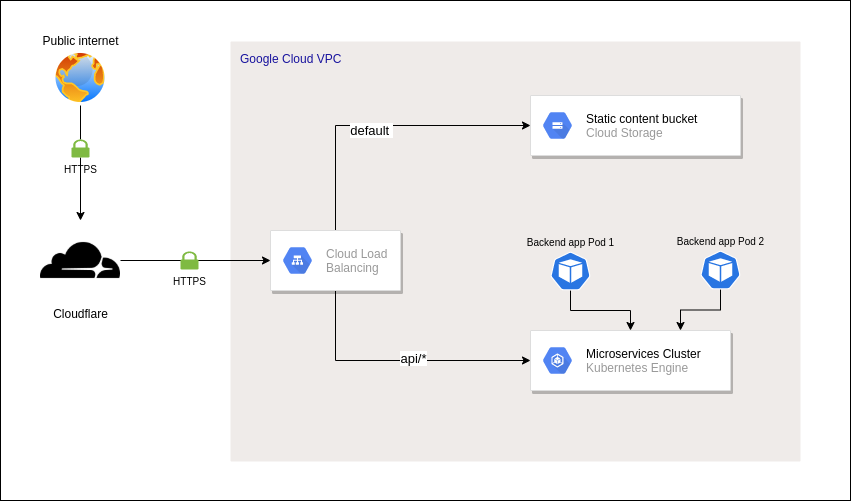

# Infra as Code App Demo

O objetivo deste projeto é disponibilizar uma stack de infraestrutura para demonstrar o deploy de uma aplicação baseada em containeres juntamente com outra aplicação que apresenta conteúdo estático, de forma que ambas respondam através do mesmo nome de domínio, mas utilizando rotas distintas.

A seguir se encontra um diagrama básico da infraestrutura provisionada com este projeto.




## Estrutura do código

O diretório `components` armazena todo o código desenvolvido, e ele está subdividido em três grupos principais:

- `core-infra`: Contém o código Terraform para provisionamento dos principais recursos de infraestrutura, como por exemplo, VPC, subredes, regras de firewall, cluster Kubernetes, load balancer e etc.
- `applications/backend-app`: Contém o código de uma aplicação backend de exemplo, incluindo o código Terraform para deploy no Kubernetes. O código de infra desta aplicação depende do deploy do módulo `core-infra` pois algumas variáveis de saída são utilizadas aqui, e além disso, o cluster GKE precisa ser provisionado para conseguirmos fazer o deploy desta aplicação.
- `applications/frontend-app`: Contém arquivos estáticos para simular uma aplicação frontend. Depende do deploy da infraestrutura base e da aplicação backend para funcionar corretamente.


## Execução local das aplicações

### Backend

A fim de facilitar o desenvolvimento local, a aplicação backend inclusa neste projeto conta com uma configuração pronta para executar o serviço em qualquer SO utilizando o Docker. Para isso, é necessário que o [Docker](https://docs.docker.com/get-docker/) e o [Docker Compose](https://docs.docker.com/compose/install/) estejam instalados no ambiente. Após a instalação, basta entrar no diretório da aplicação e executar o seguinte comando:

```sh
$ docker-compose up -d
```

Com o comando acima, o container da aplicação estará executando em modo detached, assim, para visualizar os logs basta executar:

```sh
$ docker-compose logs -f
```

Caso queira enviar uma requisição de teste, execute:

```sh
$ curl -v http://localhost:8080/hostname
```

### Frontend

Já a aplicação frontend se trata apenas de conteúdo estático, assim não é necessário executar nenhum comando, basta abrir o arquivo `index.html` em um navegador. Esta forma simples de visualizar uma aplicação frontend foi feita apenas para não tornar o projeto muito complexo. Em um cenário real é muito comum a utilização de frameworks como Angular, React ou Vue, e com isso, alguns passos extras são necessários para executar a aplicação no local.


## Deploy

### Requisitos

Antes de efetuar o deploy deste projeto é necessário verificar se você possui os seguintes componentes instalados:

- [Terraform >= 0.15.x](https://www.terraform.io/downloads.html)
- [Docker >= 20.x](https://docs.docker.com/get-docker/)
- [Google Cloud SDK](https://cloud.google.com/sdk/docs/install)
- GNU Make (opcional)

### Serviços cloud utilizados

- **GCP**: Usada para criação de todos os recursos que executam as aplicações backend e frontend.
- **Cloudflare**: Usada para atribuir o IP do load balancer a um nome de domínio previamente configurado. Além disso, a opção de uso da Cloudflare é uma forma gratuita de reduzir o impacto de ataques DDoS.

### O que é criado na infraestrutura base?

- Projeto na GCP
- VPC com uma subnet para o cluster Kubernetes.
- Gateway NAT para permitir a conexão da VPC com a internet.
- Cluster Kubernetes zonal com 1 pool de nós e autoscaling ativado.
- Load balancer público, com certificado HTTPS da Cloudflare e configuração de acesso entre os nós do cluster Kubernetes e o bucket do Cloud Storage, de acordo com o path utilizado.
- Regra de firewall para permitir a comunicação entre o Load Balancer e os nós do cluster Kubernetes.
- Bucket do Cloud Storage com acesso público para servir a aplicação frontend.
- Registro de DNS na Cloudflare com o IP do Load Balancer. Este recurso considera que um domínio foi previamente configurado na Cloudflare.

### Configurações

O primeiro passo para configurar um ambiente de deploy neste projeto é utilizar a ferramenta de linha de comando `gcloud` para se [autenticar em uma conta da Google](https://cloud.google.com/sdk/gcloud/reference/auth/application-default/login). Para que os recursos sejam criados corretamente durante o deploy, a conta autenticada precisa ter no mínimo as seguinte permissões no IAM da GCP:

- `resourcemanager.projects.create`
- `billing.resourceAssociations.create`

Também é necessário fazer a autenticação no registro de containeres da GCP, a fim de subir a imagem da aplicação backend. Para isso, utilize o comando a seguir:

```sh
gcloud auth configure-docker
```

Para mais informações sobre a autenticação no Docker, consulte a [documentação oficial](https://cloud.google.com/sdk/gcloud/reference/auth/configure-docker) da GCP.

Em seguida, precisamos definir algumas variáveis de ambiente com as credenciais da Cloudflare:

```sh
export CLOUDFLARE_API_TOKEN="cloudflare token goes here"
export CLOUDFLARE_API_USER_SERVICE_KEY="cloudflare user service key goes here"
```

O código de infraestrutura desenvolvido foi projetado para ler automaticamente as configurações definidas anteriormente, evitando assim que essas credenciais precisem ser definidas como variáveis de entrada do Terraform.

A última etapa consiste em editar os arquivos com as variáveis entrada do Terraform. Estes arquivos estão disponíveis na raiz de cada módulo Terraform com o nome `terraform.tfvars` e já foram previamente preenchidos com definições de exemplo. Porém, alguma variáveis precisam ser ajustadas por questões de permissões de acesso, e dessa forma elas serão descritas a seguir:

- No arquivo `components/core-infra/terraform.tfvars`:
  - `gcp_billing_account`: Altere para o identificador da sua conta de faturamento na GCP. O identificador pode ser encontrado [nesta página](https://console.cloud.google.com/billing).
  - `gcp_organization_id`: Defina o identificador da organização caso a sua conta da Google esteja vincula a uma organização.
  - `app_domain`: Altere para um nome de domínio pré-configurado na Cloudflare em que você possua credenciais de edição.

Com estas configurações feitas, o deploy está pronto para ser executado.

### Execução do deploy

Para tornar o deploy mais simples, foi criado um Makefile na raiz deste projeto com as tasks correspondentes a cada componente (core-infra, backend-app e frontend-app). As tasks já resolvem as dependências de cada componente, ou seja, se você tentar fazer o deploy da aplicação frontend, também será executado o deploy do backend e da infraestrutura base, pois o frontend depende disso para executar corretamente. Sendo assim, utilize os comandos a seguir na raiz do projeto.

Deploy de todos os componentes de uma só vez:
```sh
$ make deploy
```

Deploy da infraestrutura base:
```sh
$ make deploy-core-infra
```

Deploy da aplicação backend:
```sh
$ make deploy-backend-app
```

Deploy da aplicação frontend:
```sh
$ make deploy-frontend-app
```

Caso deseje entender melhor os comandos utilizados para o deploy de cada componente, navegue pelas tasks do Makefile.

Após o deploy de todos os componentes será possível acessar a url `https://${app_domain}/` e visualizar o conteúdo estático da aplicação frontend e também o conteúdo carregado a partir das rotas da aplicação backend (`/api/*`).

Para destruir todos os recursos provisionados, execute:
```sh
$ make destroy
```


## Roadmap

Apesar de demonstrar um caso de uso muito comum para projetos de infraestrutura, existem algumas melhorias a serem feitas neste projeto para que seja utilizado em um ambiente de produção real. Algumas dessas melhorias estão listadas a seguir:

- Separar recursos em outros repositórios para reduzir o escopo e facilitar a governança. Por exemplo, poderíamos criar um repositório responsável apenas pelo gerenciamento das VPCs.
- Armazenar e gerenciar o estado do Terraform em um serviço remoto, como um bucket do Cloud Storage ou S3, por exemplo. Atualmente os arquivos estado estão sendo mantidos nos diretórios locais, e isso não é uma prática recomendada para projetos reais.
- Utilizar um cluster Kubernetes regional para maior disponibilidade. O cluster criado atualmente é zonal para simplificar o código do load balancer.
- Remover o acesso público do Kubernetes. O cluster foi criado com um endpoint público para facilitar a demonstração de deploy, porém, expor a API do Kubernetes para a internet é uma falha de segurança que não deve existir em um ambiente de produção. Para uma conexão segura entre a API do Kubernetes e um recurso fora da VPC, podemos utilizar um cluster GKE privado e uma VPN para conectar as duas pontas.
- Servir o conteúdo HTML através de outro serviço da GCP (como o Kubernetes ou o AppEngine), pois o Load Balancer não permite reescrita de urls, e com isso, ao visitar uma página diferente de `/` ou `/index.html`, é retornado status 404 no navegador já que o arquivo solicitado realmente não existe no bucket. Sendo assim, o uso direto do Load Balancer + Cloud Storage não é recomendado para Single Page Applications.
- Adicionar outras váriáveis de entrada aos códigos Terraform para permitir uma melhor customização entre ambientes de produção e staging/qa. Por exemplo, em um cluster Kuberentes de um ambiente de staging não precisamos de instâncias com CPU e RAM muito grandes.
- Escrever o processo de deploy dos componentes em uma ferramenta de CICD para evitar a execução manual, pois além de evitar falhas humanas, isso também evita o vazamento de credenciais e outras informações sensíveis.